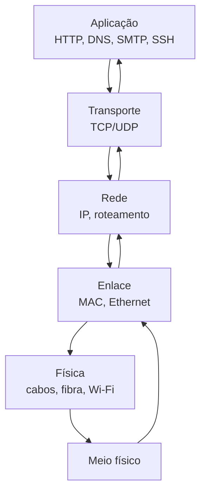

# Redes de Computadores e Protocolos

Um curso didático, prático e aprofundado para aprender redes de computadores, protocolos e análise de tráfego.

## Visão geral

Este repositório foi pensado para transformar a rede em algo intuitivo. Em vez de decorar nomes de protocolos, você vai entender o fluxo real da comunicação digital: como uma mensagem sai do seu computador, atravessa a rede, chega ao destino e volta.

A ideia central é simples:

- a rede é um sistema de transporte de dados
- cada camada resolve um problema específico
- cada protocolo cumpre uma função bem definida
- Wireshark é a lente que permite enxergar aquilo que antes parecia invisível

---

## Como estudar redes sem ficar perdido

A melhor forma de aprender redes é pensar assim:

- o computador quer mandar uma mensagem
- o sistema precisa saber para quem enviar
- precisa saber como entregar de forma confiável
- precisa lidar com endereço, rota, porta, conexão e segurança
- tudo isso acontece em camadas, em uma sequência lógica

### Analogia simples

Imagine que você manda uma carta:

- o endereço do destinatário é o IP
- a pessoa no correio precisa saber por onde entregar é o roteamento
- o envelope com informações internas é o cabeçalho do protocolo
- o conteúdo da carta é o payload
- a segurança da entrega pode ser comparada ao TLS

Se a carta vai para o mundo digital, os protocolos são as regras de trânsito que fazem esse caminho acontecer sem caos.

---

## Mapa mental da rede



A comunicação digital funciona como uma cadeia de responsabilidade:

- a aplicação pede algo
- o transporte organiza a entrega
- a rede escolhe o caminho
- o enlace conecta diretamente
- a física transporta os bits

---

## Objetivos do curso

Ao final deste estudo, você deve ser capaz de:

- explicar o modelo OSI e TCP/IP com clareza
- diferenciar TCP e UDP
- entender IP, roteamento e endereçamento
- dominar protocolos essenciais como HTTP, HTTPS, DNS, SSH, FTP, SMB e SMTP
- ler e interpretar pacotes com Wireshark
- diagnosticar problemas de rede com lógica e técnica
- compreender como a comunicação de dados funciona na prática

---

## Estrutura do repositório

```text
.
├── README.md
├── docs/
│   ├── roadmap.md
│   ├── osi-tcpip.md
│   ├── protocolos.md
│   ├── wireshark.md
│   └── analogias-e-mapas.md
├── labs/
│   ├── README.md
│   ├── laboratorio-01-osi.md
│   ├── laboratorio-02-ip-tcp-udp.md
│   ├── laboratorio-03-dns-http.md
│   ├── laboratorio-04-wireshark.md
│   └── laboratorio-05-troubleshooting.md
├── resources/
│   ├── glossario.md
│   ├── comandos.md
│   └── checklist.md
├── .gitignore
├── LICENSE
└── .github/
    └── (opcional)
```

---

## Módulos do curso

### 1. Fundamentos de redes

- o que é rede
- tipos de rede: LAN, MAN, WAN
- topologias
- cabos, fibra, Wi‑Fi
- latência, throughput, jitter e perda de pacote
- endereçamento MAC e IP

### 2. Modelo OSI e TCP/IP

- camada física
- enlace
- rede
- transporte
- sessão
- apresentação
- aplicação
- comparação entre OSI e TCP/IP
- encapsulamento e desencapsulamento

### 3. Transporte: TCP e UDP

- conexão e confiabilidade
- handshake TCP
- portas
- flow control
- congestion control
- quando usar TCP e quando usar UDP

### 4. Protocolos essenciais

- HTTP/HTTPS
- DNS
- SSH
- FTP
- SMB
- SMTP

### 5. Análise de tráfego

- capturar pacotes
- filtros no Wireshark
- interpretar fluxos
- identificar problemas de rede
- analisar requisições e respostas

### 6. Troubleshooting

- ping
- traceroute
- nslookup/dig
- arp
- netstat
- portas abertas e fechadas
- diagnóstico de falhas

---

## Tabela rápida: o que cada camada faz

| Camada | Papel | Exemplo | Analogia |
|---|---|---|---|
| Física | Transporta bits no meio | cabo, fibra, Wi‑Fi | estradas e fios |
| Enlace | Conecta diretamente os dispositivos | Ethernet, MAC | bairro e portão |
| Rede | Encaminha pacotes | IP, roteamento | mapa da cidade |
| Transporte | Garante entrega e ordem | TCP, UDP | correio e entrega confiável |
| Aplicação | Interage com usuário e serviço | HTTP, DNS, SMTP | mensagem que você envia |

---

## Analogia: a rede como uma cidade

Imagine uma cidade:

- a rua e os fios são a camada física
- os prédios e portas são a camada de enlace
- os mapas e rotas são a camada de rede
- o correio e a logística são a camada de transporte
- as pessoas pedindo serviços são a camada de aplicação

Cada parte tem uma função. Se uma parte falha, o sistema inteiro sente o problema.

---

## Por que o Wireshark é tão importante

O Wireshark é como olhar pela janela de um trem em movimento. Ele mostra o que está trafegando, quem está falando com quem, que tipo de protocolo foi usado e em que ordem os dados chegaram.

Sem esse tipo de visão, você entende teoria, mas não enxergar a rede em ação.

---

## Sequência ideal de estudo

1. Fundamentos de redes
2. OSI e TCP/IP
3. IP, roteamento e endereçamento
4. TCP e UDP
5. HTTP, HTTPS e DNS
6. SSH, FTP, SMB e SMTP
7. Wireshark
8. Diagnóstico e troubleshooting
9. Segurança e práticas de rede

---

## Ferramentas essenciais

- Wireshark
- tcpdump
- ping
- traceroute / tracert
- nslookup / dig
- ipconfig / ifconfig
- arp
- netstat
- curl
- nmap

---

## Como usar este repositório

- comece pelo README
- siga os módulos em ordem
- leia os fundamentos antes de protocolos
- depois pratique nos laboratórios
- use Wireshark para visualizar o tráfego real

---

## Checklist de aprendizagem

- [ ] entendi o modelo OSI
- [ ] entendi o modelo TCP/IP
- [ ] entendi IP e roteamento
- [ ] entendi TCP e UDP
- [ ] entendi HTTP, HTTPS e DNS
- [ ] entendi SSH, FTP, SMB e SMTP
- [ ] capturei tráfego com Wireshark
- [ ] diagnosei um problema de rede
- [ ] relatei e expliquei o fluxo de comunicação

---

## Objetivo final

O objetivo deste repositório não é apenas ver nomes de protocolos. O objetivo é entender a lógica da comunicação entre computadores e aprender a ler o comportamento da rede como quem realmente domina a infraestrutura.

Quando você entende redes, você entende como a Internet funciona por dentro.

---

## Próximo passo

Continue explorando os módulos e laboratórios. A melhor forma de aprender redes é combinar teoria + prática + análise de pacotes.

Se quiser evoluir esse material, os próximos passos podem ser:

- adicionar mais diagramas visuais
- criar exercícios por nível de dificuldade
- incluir mini laboratórios em Wireshark
- expandir para tópicos de segurança e redes corporativas

---

Este material foi pensado para ser claro, visual e didático, com foco em aprendizado real e compreensão profunda da rede.
