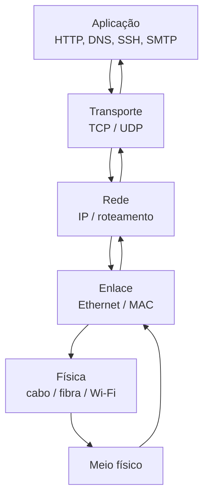

# Redes de Computadores e Protocolos

[](https://github.com/labforense/redes-computadores-protocolos)
[](LICENSE)

Um curso didático, prático e aprofundado para aprender redes de computadores, protocolos e análise de tráfego.

## Visão geral

Este repositório foi pensado para transformar redes em algo claro e intuitivo. Em vez de decorar nomes de protocolos, o objetivo aqui é entender o fluxo real da comunicação digital: como uma mensagem sai do seu computador, atravessa a rede, chega ao destino e volta.

A ideia central é simples:

- a rede é um sistema de transporte de dados
- cada camada resolve um problema específico
- cada protocolo cumpre uma função bem definida
- o Wireshark permite enxergar a rede em ação

---

## Por que aprender redes assim

A melhor forma de aprender redes é responder uma pergunta básica:

- o dispositivo quer mandar uma mensagem
- precisa saber para quem mandar
- precisa escolher o caminho correto
- precisa garantir que a entrega seja confiável
- precisa organizar a comunicação em camadas

Em outras palavras, redes não são uma lista de siglas soltas. São um sistema lógico de comunicação.

---

## Analogia: a rede como uma cidade

Imagine uma cidade:

- as ruas e fios são a camada física
- os prédios e portões são a camada de enlace
- os mapas e rotas são a camada de rede
- a logística e a entrega são a camada de transporte
- as pessoas pedindo serviços são a camada de aplicação

Se uma parte falha, o sistema inteiro sofre. É a mesma lógica da rede.

---

## Mapa mental da comunicação



A comunicação digital funciona como uma cadeia de responsabilidade:

- a aplicação pede algo
- o transporte organiza a entrega
- a rede escolhe o caminho
- o enlace conecta diretamente
- a física transporta os bits

---

## Objetivos de aprendizagem

Ao final deste estudo, você será capaz de:

- explicar o modelo OSI e TCP/IP com clareza
- diferenciar TCP e UDP
- entender IP, roteamento e endereçamento
- dominar protocolos essenciais como HTTP, HTTPS, DNS, SSH, FTP, SMB e SMTP
- interpretar pacotes reais com Wireshark
- diagnosticar falhas de rede com lógica e técnica
- compreender como a Internet funciona por dentro

---

## Roadmap de estudo

### Nível 1 — Fundamentos

- redes e topologias
- tipos de redes
- endereçamento MAC e IP
- latência, throughput e perda de pacote

### Nível 2 — Arquitetura

- modelo OSI
- modelo TCP/IP
- encapsulamento
- roteamento básico

### Nível 3 — Transporte

- TCP
- UDP
- portas
- handshake
- confiabilidade e velocidade

### Nível 4 — Protocolos

- HTTP/HTTPS
- DNS
- SSH
- FTP
- SMB
- SMTP

### Nível 5 — Prática

- Wireshark
- troubleshooting
- análise de tráfego
- diagnóstico real de falhas
- leitura de fluxos HTTP, DNS e TCP

### Nível 6 — Diagnóstico profissional

- inspeção de pacotes em contexto real
- diferenciação entre falhas de DNS, roteamento e aplicação
- análise de retransmissão e timeout
- interpretação de respostas HTTP/TLS em ambiente real

---

## Tabela rápida: o que cada camada faz

| Camada | Papel principal | Exemplo | Analogia |
|---|---|---|---|
| Física | transmite os bits | cabo, fibra, Wi‑Fi | estradas e fios |
| Enlace | conecta diretamente os dispositivos | Ethernet, MAC | bairro e portão |
| Rede | roteia os pacotes | IP, roteamento | mapa da cidade |
| Transporte | garante entrega e ordem | TCP, UDP | correio e logística |
| Aplicação | interage com serviços e usuários | HTTP, DNS, SMTP | pedido e resposta |

---

## Protocolos essenciais em uma visão prática

| Protocolo | Função | Porta comum | Observação |
|---|---|---:|---|
| HTTP | navegação web | 80 | texto simples |
| HTTPS | navegação segura | 443 | usa TLS |
| DNS | resolve nomes em IP | 53 | traduz domínios |
| SSH | acesso remoto seguro | 22 | administra servidores |
| FTP | transferencia de arquivos | 21 | legado e inseguro sem proteção |
| SMB | compartilhamento de arquivos | 445 | muito usado em redes locais |
| SMTP | envio de e-mail | 25 / 587 | base do e-mail |

---

## Wireshark e análise de tráfego

O Wireshark é a ferramenta que permite ver a rede como ela realmente funciona. Ele mostra:

- quem está falando com quem
- quais protocolos estão sendo usados
- a ordem dos pacotes
- possíveis erros e atrasos
- problemas de conexão e desempenho

É a melhor forma de transformar teoria em prática.

---

## Estrutura do repositório

```text
.
├── README.md
├── docs/
│   ├── roadmap.md
│   ├── osi-tcpip.md
│   ├── protocolos.md
│   ├── wireshark.md
│   ├── wireshark-e-troubleshooting.md
│   ├── handshakes-e-fluxos.md
│   ├── analogias-e-mapas.md
│   └── (módulos adicionais em evolução)
├── labs/
│   ├── README.md
│   ├── laboratorio-01-osi.md
│   ├── laboratorio-02-ip-tcp-udp.md
│   ├── laboratorio-03-dns-http.md
│   ├── laboratorio-04-wireshark.md
│   ├── laboratorio-05-troubleshooting.md
│   ├── laboratorio-06-wireshark-troubleshooting.md
│   └── exercicios-praticos.md
├── resources/
│   ├── glossario.md
│   ├── comandos.md
│   └── checklist.md
├── .gitignore
├── LICENSE
└── .github/
    └── (opcional)
```

---

## Como usar este material

1. comece pelo README
2. siga a ordem dos módulos
3. leia a teoria primeiro
4. pratique nos laboratórios
5. use Wireshark para observar tráfego real
6. revise o glossário e checklist

---

## Checklist de aprendizagem

- [ ] entendi o modelo OSI
- [ ] entendi o modelo TCP/IP
- [ ] entendi IP e roteamento
- [ ] entendi TCP e UDP
- [ ] entendi DNS e HTTP/HTTPS
- [ ] entendi SSH, FTP, SMB e SMTP
- [ ] capturei tráfego com Wireshark
- [ ] diagnosei um problema de rede
- [ ] consigo explicar o fluxo da comunicação

---

## Objetivo final

O objetivo deste repositório não é apenas memorizar protocolos. O objetivo é entender a lógica da comunicação entre computadores e aprender a ler a rede como quem realmente conhece a infraestrutura.

Quando você entende redes, você entende como a Internet e a comunicação digital funcionam por dentro.

---

## Próximo passo

Continue pelos módulos e laboratórios. A melhor forma de aprender redes é combinar:

- teoria
- analogias
- prática
- análise de pacotes
- troubleshooting

Se quiser evoluir esse material, os próximos passos podem incluir:

- diagramas mais avançados
- exercícios por nível
- laboratórios de Wireshark mais profundos
- módulos de segurança e redes corporativas

---

Este material foi pensado para ser claro, visual e didático, com foco em aprendizado real e compreensão profunda da rede.
