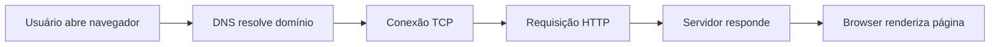
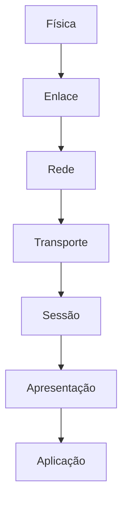
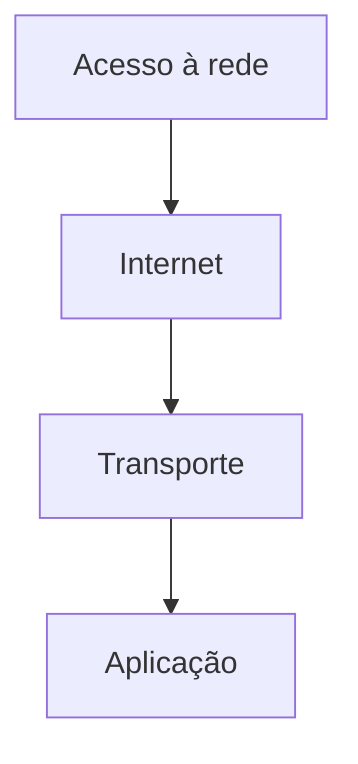

# Analogias e mapas mentais

## 1. A rede como uma cidade

Imagine uma cidade grande:

- as ruas e fios são a camada física
- os quarteirões e portas são a camada de enlace
- os mapas de rua são a camada de rede
- o correio e a logística são a camada de transporte
- as pessoas pedindo serviço representam a camada de aplicação

Se alguém passa pela cidade sem mapa, fica perdido. Na rede, sem roteamento, sem endereço e sem protocolo, o dado também fica perdido.

---

## 2. O pacote como uma carta

Uma carta tem:

- endereço do destino
- remetente
- devolução
- envelope
- mensagem interna

Na rede, um pacote tem:

- endereço de origem e destino
- cabeçalho com controle
- payload com os dados úteis

A diferença é que a carta pode ser lida por uma pessoa, mas o pacote é interpretado por máquinas e protocolos.

---

## 3. HTTP como pedido em um restaurante

Quando você pede um prato:

1. você faz o pedido
2. o garçom leva até a cozinha
3. a cozinha prepara o conteúdo
4. o garçom retorna a resposta

No HTTP:

1. cliente envia requisição
2. servidor recebe e processa
3. responde com dados
4. browser interpreta e exibe

---

## 4. DNS como agenda telefônica

Sem o DNS você teria que memorizar:

- 142.250.218.14
- 104.16.120.185
- 216.58.222.46

Em vez disso, você usa nomes amigáveis como:

- google.com
- github.com
- youtube.com

O DNS faz a tradução de nome para endereço IP.

---

## 5. TCP como entrega com confirmação

TCP é como uma entrega expressa com protocolo:

- você pede uma entrega
- o entregador confirma a recepção
- se algo falhar, a entrega é reenviada
- o destinatário confirma a chegada

Esse é o conceito de confiabilidade.

---

## 6. UDP como mensagem rápida

UDP é mais parecido com um bilhete enviado sem pedir confirmação:

- envia rápido
- não garante entrega
- funciona bem para vídeo, voz e DNS

É ideal quando velocidade importa mais do que garantia absoluta.

---

## 7. Mapa mental do fluxo de uma requisição web



---

## 8. Mapa mental do modelo OSI



Cada camada adiciona uma parte do problema que precisa ser resolvido.

---

## 9. Mapa mental do modelo TCP/IP



É uma visão mais prática e usada na Internet.

---

## 10. Visualização de encapsulamento

```text
Aplicação   -> HTTP
Transporte  -> TCP
Rede        -> IP
Enlace      -> Ethernet
Física      -> sinais elétricos / ondas
```

Cada camada coloca o dado em um envelope diferente. A camada de cima envia para a de baixo, que adiciona informações. No destino, o processo é inverso.

---

## 11. Tabela mental: entender o que cada coisa faz

| Conceito | O que faz | Analogía |
|---|---|---|
| IP | Identifica o destino lógico | endereço da casa |
| MAC | Identifica a interface física | placa ou porta do prédio |
| TCP | Entrega confiável | entrega com confirmação |
| UDP | Entrega rápida | mensagem urgente |
| DNS | Traduza nome para IP | agenda telefônica |
| HTTP | Pede e recebe páginas | pedido em restaurante |
| SSH | Acesso remoto seguro | porta segura para entrar |
| SMTP | Envia mensagens | correio eletrônico |

---

## 12. Como interpretar a rede sem se perder

Sempre pergunte:

- quem está enviando?
- quem está recebendo?
- qual protocolo está no comando?
- a comunicação é confiável ou rápida?
- existe criptografia?
- há falha ou atraso?

Essa mentalidade torna a rede muito mais clara.

---

## 13. Regra de ouro

Não aprenda redes só pela teoria. Aprenda pela pergunta:

“o que está acontecendo entre cliente, servidor e rede neste exato momento?”

Quando você faz essa pergunta, a rede deixa de ser um conjunto de siglas e vira um fluxo lógico de comunicação.
