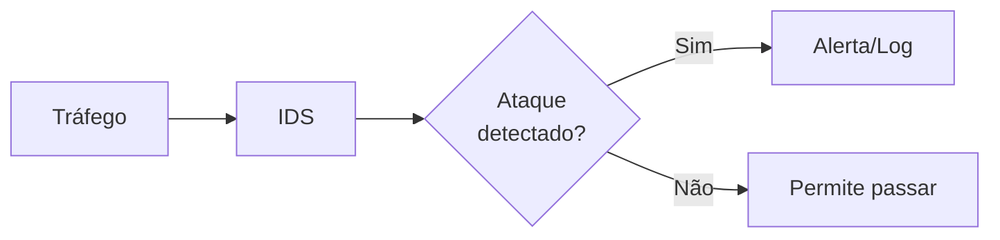
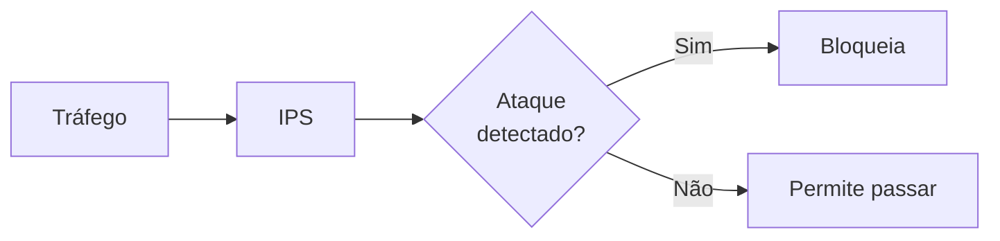
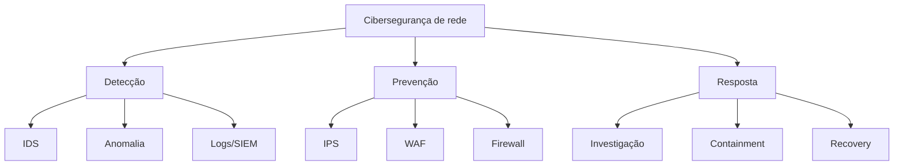

# Cibersegurança de redes — detecção e resposta a ameaças

## 1. O cenário moderno

Ataques de rede são constantes:

- **DDoS**: derrubar serviço com tráfego massivo
- **Malware**: código malicioso que se propaga
- **Man-in-the-middle**: interceptar comunicação
- **SQL Injection**: explorar banco de dados via aplicação
- **Phishing**: enganar usuários
- **Zero-day**: explorar vulnerabilidade desconhecida

Você precisa assumir que será atacado. A questão é: **você consegue detectar e responder rápido?**

---

## 2. IDS vs IPS vs WAF

### IDS — Intrusion Detection System

**O que faz**: monitora tráfego e **avisa** quando detecta ataque.



**Problema**: só avisa, não bloqueia. Você precisa reagir.

---

### IPS — Intrusion Prevention System

**O que faz**: monitora tráfego e **bloqueia** quando detecta ataque.



**Vantagem**: proteção automática, sem delay.
**Risco**: falso positivo pode bloquear tráfego legítimo.

---

### WAF — Web Application Firewall

**Foco**: aplicações web (HTTP/HTTPS)

**Detecção**: SQL Injection, XSS, CSRF, LFI, etc

**Localização**: na frente do servidor web

```
[Internet] --> [WAF] --> [Servidor Web]
```

---

## 3. Métodos de detecção

### Detecção baseada em assinatura

```
Assinatura 1: IP conhecido malicioso
Assinatura 2: padrão de SQL Injection
Assinatura 3: tamanho anormal de pacote
Assinatura 4: porta 666 (suspeita)

Se tráfego bate em assinatura → alerta
```

**Vantagem**: preciso, poucos falsos positivos
**Desvantagem**: não detecta ataques novos (zero-day)

---

### Detecção baseada em anomalia

```
Comportamento normal:
- 10-50 requisições por segundo
- CPU do servidor 30-60%
- 1-5 conexões simultâneas por usuário

Anomalia detectada:
- 10.000 requisições por segundo (DDoS)
- CPU 99%
- 1.000 conexões simultâneas de 1 IP (ataque)

Alerta!
```

**Vantagem**: detecta ataques novos
**Desvantagem**: muitos falsos positivos

---

### Híbrido

Combina ambos:
- assinatura para ataques conhecidos (rápido)
- anomalia para comportamento estranho (robusto)

---

## 4. Ferramentas de segurança

### Snort

IDS/IPS open source muito popular

```bash
# Modo IDS (monitor)
snort -i eth0 -c /etc/snort/snort.conf -l /var/log/snort -A full

# Modo IPS (bloqueia)
snort -i eth0 -c /etc/snort/snort.conf -l /var/log/snort -A full -Q
```

---

### Suricata

IDS/IPS mais moderno

```bash
suricata -c /etc/suricata/suricata.yaml -i eth0
```

Vantagem: regras compatíveis com Snort, melhor performance

---

### ModSecurity (WAF)

Proteção de aplicações web

```bash
# Apache
mod_security for Apache

# Nginx
ModSecurity nginx
```

---

## 5. Análise de comportamento e investigação

### Quando você detecta um ataque

```
1. Alerta chega
2. Você investiga: qual IP? qual padrão?
3. Você valida: é realmente um ataque ou falso positivo?
4. Você contém: isola o atacante
5. Você erradica: remove malware
6. Você recupera: restaura normal
7. Você aprende: por que funcionou?
```

---

### Análise em Wireshark

Se você capturou o tráfego malicioso:

```
Filtro para SQL Injection:
http.request.method == "GET" and 
http.request.uri.query contains "union" or
http.request.uri.query contains "select"

Filtro para XSS:
http.response.body contains "script" and
http.response.body contains "alert"
```

---

## 6. Malware e propagação

### Tipos de malware

| Tipo | Função | Transmissão |
|---|---|---|
| Vírus | se replica anexo a programa | usuário executa |
| Worm | se replica via rede | rede (exploração) |
| Trojan | parece legítimo, executa código malicioso | download, e-mail |
| Ransomware | criptografa dados e pede resgate | spam, exploração |
| Botnet | máquina comprometida em rede de bots | exploração, malware |

---

### Detecção de malware na rede

```
Sinais em Wireshark:
- conexão para IP desconhecido porta 4444 (shell remoto)
- tráfego DNS para domínio suspeito
- múltiplas conexões SSH falhadas (brute force)
- tráfego incomum para máquina nunca vista

Sinais no SNMP:
- CPU alta sem razão óbvia
- memória crescendo continuamente
- I/O de disco anormalmente alto
```

---

## 7. DDoS — Distributed Denial of Service

### Tipos de DDoS

### Layer 3 (Rede)

```
IP flooding: enviar bilhões de pacotes IP
ICMP flood: ping de bilhões de máquinas
```

---

### Layer 4 (Transporte)

```
TCP SYN flood: enviar SYN sem completar handshake
UDP flood: enviar UDP para saturar link
```

---

### Layer 7 (Aplicação)

```
HTTP flooding: requisições GET/POST válidas, mas volumosas
Slowloris: conexões lentas que seguram recursos
```

---

### Defesa contra DDoS

```
Camada 1-4:
- rate limiting no roteador
- blocking automático de IP suspeito
- geração de tráfego legítimo vs ataque (heurística)

Camada 7:
- WAF com rate limiting por sessão
- CAPTCHA desafio para humanos
- cache de respostas
- loadbalancer distribuindo carga

Estratégia geral:
- ISP filtra tráfego upstream
- CDN absorve ataque
- only-if-necessary whitelist
```

---

## 8. Vulnerabilidades de aplicação

### OWASP Top 10

Os 10 maiores riscos de segurança em aplicações web:

1. **Broken Access Control**: usuário acessa recurso que não deveria
2. **Cryptographic Failures**: falha em criptografia
3. **Injection**: SQL, OS, LDAP injection
4. **Insecure Design**: falha fundamental no design
5. **Security Misconfiguration**: config fraca
6. **Vulnerable Outdated Components**: biblioteca/framework desatualizado
7. **Authentication Failures**: login quebrado
8. **Data Integrity Failures**: dados não validados
9. **Logging/Monitoring Failures**: sem logs de ataque
10. **SSRF**: server-side request forgery

---

### SQL Injection — exemplo prático

```sql
-- Entrada legítima
username: admin
password: senha123

Query: SELECT * FROM users WHERE username='admin' AND password='senha123'

-- Entrada maliciosa
username: admin' OR '1'='1
password: qualquer

Query: SELECT * FROM users WHERE username='admin' OR '1'='1' AND password='qualquer'
-- Isso retorna TODOS os usuários!
```

**Prevenção**: usar prepared statements (parametrized queries)

---

## 9. Segurança de endpoints

### O que proteger

```
Computador do usuário:
├── antivírus
├── firewall pessoal
├── atualizações de SO
├── senhas fortes
├── autenticação multifator
└── não clicar em links suspeitos
```

---

### EDR — Endpoint Detection and Response

Ferramentas que monitoram cada máquina:

- detecção de malware em tempo real
- análise de comportamento
- isolamento automático se comprometido
- resposta forense

Exemplos: CrowdStrike, Microsoft Defender, Sophos

---

## 10. Plano de resposta a incidente

### Timeline típica

```
T+0 min: Alerta recebido
T+5 min: Investigação inicial
T+15 min: Decisão: falso positivo? real?
T+30 min: Containment (isolar o atacante)
T+60 min: Eradication (remover malware)
T+120 min: Recovery (restaurar normal)
T+1440 min: Post-mortem (aprender)
```

---

### Equipe de resposta

- **SOC (Security Operations Center)**: monitora 24/7
- **Incident Commander**: lidera resposta
- **Network Engineer**: isola rede
- **System Admin**: recupera servidores
- **Forensics**: investiga origem

---

## 11. Checklist de cibersegurança de rede

- [ ] IDS/IPS está monitorando?
- [ ] Alertas são testados e validados?
- [ ] WAF protegendo aplicações web?
- [ ] Logs centralizados (SIEM)?
- [ ] Antivírus/EDR em todos endpoints?
- [ ] Vulnerability scanning regular?
- [ ] Penetration testing anual?
- [ ] Plano de resposta a incidente?
- [ ] Equipe treinada?
- [ ] Seguro de cibersegurança?

---

## 12. Mapa mental de cibersegurança



---

## 13. Exercícios de reflexão

1. Qual é a diferença entre IDS e IPS?
2. Como você detectaria um DDoS?
3. O que é SQL Injection e como prevenir?
4. Qual seria seu plano se um servidor fosse comprometido?
5. Como você testaria suas defesas?

Se você conseguir investigar um ataque real no Wireshark, você é um analista de segurança.
