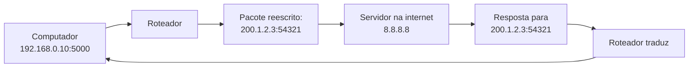
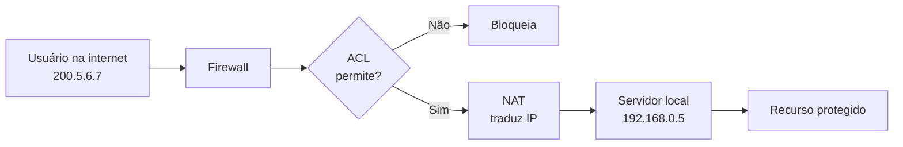
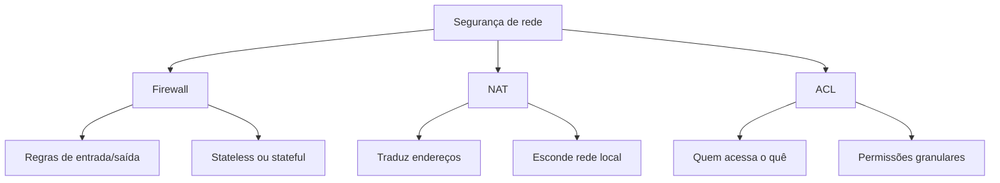

# Firewall, NAT e ACL — os guardiões da rede

## 1. O que é um firewall?

Um firewall é um guardião de rede. Ele:

- decide quais pacotes entram
- decide quais pacotes saem
- monitora o tráfego
- bloqueia ameaças
- aplica regras de negócio

Sem firewall, qualquer um de fora da rede consegue acessar qualquer coisa. Com firewall, você controla tudo.

---

## 2. Analogia: o firewall como um segurança de boate

Imagine uma boate:

- toda pessoa que entra passa pelo segurança
- o segurança tem uma lista de quem entra
- verifica a idade e a identidade
- pode recusar quem não cumpre as regras
- monitora quem vai embora

O firewall funciona assim:

- recebe cada pacote
- verifica se ele segue as regras
- deixa passar ou bloqueia
- registra cada ação

---

## 3. Tipos de firewall

### 3.1 Firewall de rede

**Localização**: na borda da rede, entre a rede local e a internet

**Função**:
- protege toda a rede
- geralmente é um hardware dedicado
- exemplo: Cisco ASA, Palo Alto, Fortinet

**Regras**:
- controla tráfego entre redes
- geralmente mais simples (camada 3/4)

---

### 3.2 Firewall pessoal

**Localização**: no próprio computador

**Função**:
- protege apenas esse dispositivo
- geralmente é software
- exemplo: Windows Defender Firewall, UFW no Linux

**Regras**:
- mais granulares
- pode inspecionar aplicação (camada 7)

---

### 3.3 Firewall de aplicação (WAF)

**Localização**: entre cliente e servidor web

**Função**:
- entende HTTP e HTTPS
- bloqueia ataques específicos de web
- exemplo: ModSecurity, Cloudflare WAF

**Regras**:
- detecta injeção SQL, XSS, etc
- valida padrões de aplicação

---

## 4. Como as regras de firewall funcionam

### Regra básica

```
Protocolo: TCP
Porta de origem: qualquer
Porta de destino: 443
Endereço de origem: qualquer
Endereço de destino: 192.168.0.5
Ação: ACEITAR
```

Isso significa: "qualquer um pode enviar TCP para a porta 443 do servidor 192.168.0.5".

### Ordenação das regras

```
Regra 1: bloqueie TCP porta 22 do IP 10.0.0.10
Regra 2: aceite TCP porta 22 de qualquer lugar
Regra 3: bloqueie tudo mais
```

**Importante**: as regras são verificadas na ordem. A primeira que bate é executada.

---

## 5. Inspeção de firewall

### Inspeção sem estado (stateless)

- olha apenas o pacote atual
- não lembra de pacotes anteriores
- mais rápido, menos seguro

### Inspeção com estado (stateful)

- lembra da conexão (handshake TCP, por exemplo)
- bloqueia respostas que não correspondem a conexões abertas
- mais lento, muito mais seguro

**Exemplo prático**:

```
Pacote 1: Cliente envia SYN para servidor na porta 443
Firewall: "aceito, abro conexão"
Pacote 2: Servidor responde SYN-ACK
Firewall: "confirmo, essa resposta corresponde à conexão"
Pacote 3: Alguém envia um pacote SYN-ACK de fora
Firewall: "bloqueio, não há conexão aberta para isso"
```

---

## 6. NAT — a ilusão de múltiplos endereços

### O que é NAT?

NAT (Network Address Translation) transforma endereços IP de um lado da rede para outro.

**Caso de uso comum**: sua rede local tem apenas um IP público

```
192.168.0.10 (computador local) → NAT → 200.1.2.3 (IP público)
```

---

### Como funciona?



**O roteador faz um mapeamento**:
- porta 5000 do IP local → porta 54321 do IP público
- guarda essa informação
- quando a resposta chega, traduz de volta

---

### Tipos de NAT

| Tipo | Função | Caso de uso |
|---|---|---|
| Static NAT | um IP local vira sempre o mesmo IP público | servidor exposto |
| Dynamic NAT | um IP local vira um IP público disponível | rede com múltiplos públicos |
| PAT (Port Address Translation) | múltiplos locais compartilham um IP público | rede doméstica típica |

---

### Implicações de segurança

**Vantagem**: seus computadores locais não são diretamente acessíveis de fora

**Desvantagem**: dificulta certos tipos de comunicação (P2P, VoIP direto)

---

## 7. ACL — Listas de Controle de Acesso

ACL (Access Control List) define quem pode acessar quê.

### Exemplo de ACL em um servidor

```
Permitir: SSH (porta 22) apenas de 10.0.0.0/24
Permitir: HTTP (porta 80) de qualquer lugar
Permitir: HTTPS (porta 443) de qualquer lugar
Bloquear: tudo mais
```

### Exemplo de ACL em compartilhamento de arquivo

```
Usuário: Alice
Arquivo: /home/docs/financeiro.pdf
Permissão: ler e escrever

Usuário: Bob
Arquivo: /home/docs/financeiro.pdf
Permissão: ler apenas
```

---

## 8. Combinando firewall + NAT + ACL



---

## 9. Configuração prática de firewall

### Regra em linguagem natural

"Bloquear toda comunicação de fora, exceto:
- SSH (port 22) apenas de 10.0.0.0/24
- HTTP (port 80) de qualquer lugar
- HTTPS (port 443) de qualquer lugar"

### Regra em pseudocódigo de firewall

```
RULE 1:
  Protocol: TCP
  Direction: inbound
  Port: 22
  Source: 10.0.0.0/24
  Destination: any
  Action: ALLOW

RULE 2:
  Protocol: TCP
  Direction: inbound
  Port: 80
  Source: any
  Destination: any
  Action: ALLOW

RULE 3:
  Protocol: TCP
  Direction: inbound
  Port: 443
  Source: any
  Destination: any
  Action: ALLOW

RULE 4:
  Direction: inbound
  Action: DENY (padrão)
```

---

## 10. Troubleshooting de firewall

### Problema: não consegue conectar ao servidor

**Checklist**:
1. o servidor está respondendo? (teste com ping)
2. a porta correta está aberta? (teste com telnet ou nc)
3. o firewall está bloqueando? (verifique regras)
4. o NAT está correto? (verifique mapeamento)
5. há rota até o servidor? (teste com traceroute)

---

### Problema: conexão lenta

**Possíveis causas**:
- firewall inspecionando cada pacote (stateful)
- muitas regras sendo verificadas
- tráfego sendo registrado excessivamente

**Solução**:
- otimize regras mais comuns no topo
- use bypass para tráfego confiável
- limite logging

---

## 11. Mapa mental de firewall + NAT + ACL



---

## 12. Exercícios de reflexão

1. Qual é a diferença entre firewall e NAT?
2. Por que inspeção stateful é mais segura?
3. Se uma ACL não permite um arquivo, qual é a mensagem que você vê?
4. Como você testaria se uma porta está aberta?
5. O que um atacante vê quando faz port scan em uma rede protegida?

Se você conseguir pensar em cenários reais para essas respostas, já entende como proteger redes de verdade.
