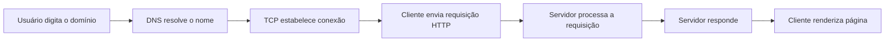
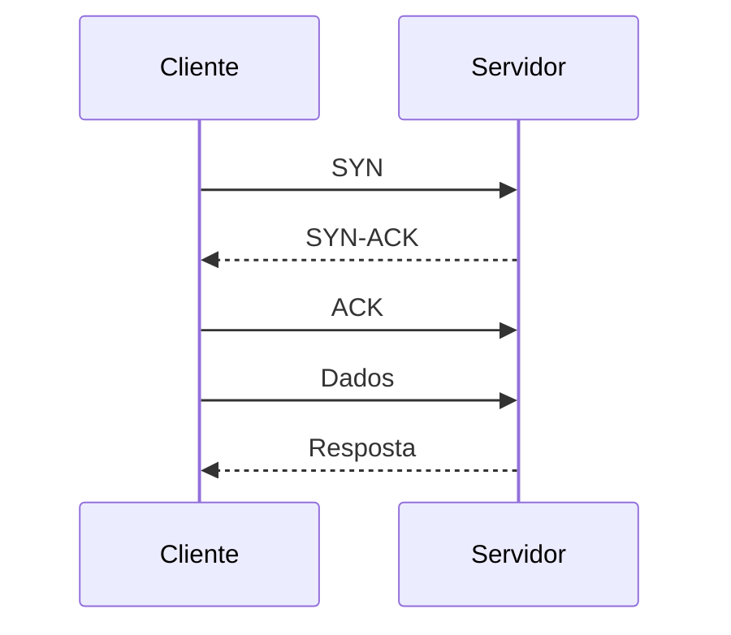
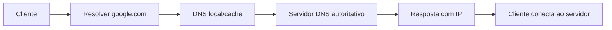

# Handshakes, fluxos e caminhos reais da rede

## 1. O fluxo completo de uma requisição web

Quando você acessa um site, o processo costuma seguir esta sequência:



### O que acontece em cada etapa

- DNS resolve o domínio para um endereço IP
- TCP faz o handshake para iniciar a comunicação
- HTTP envia uma requisição com método, headers e dados
- o servidor responde com status e conteúdo
- o cliente interpreta e exibe

---

## 2. Handshake TCP em detalhes

O TCP usa um processo chamado three-way handshake para abrir uma conexão.



### Explicando cada passo

- SYN: cliente quer iniciar a conexão
- SYN-ACK: servidor responde e confirma disponibilidade
- ACK: cliente confirma que recebeu a resposta

Depois disso, os dados podem começar a trafegar.

### Por que isso importa?

Porque o TCP é orientado à conexão e busca confiabilidade.

Ele garante:

- ordem dos pacotes
- retransmissão
- controle de fluxo
- confirmação de recebimento

---

## 3. DNS em fluxo real

DNS é o processo de resolver um nome em endereço IP.



### Registros comuns

- A: IPv4
- AAAA: IPv6
- MX: e-mail
- NS: servidor DNS
- CNAME: alias

### O que a resolução observa

- cache local
- servidor DNS configurado
- TTL
- servidor autoritativo

---

## 4. HTTP/HTTPS em ação

### Requisição HTTP

```http
GET /index.html HTTP/1.1
Host: example.com
User-Agent: Mozilla/5.0
Accept: text/html
```

### Resposta HTTP

```http
HTTP/1.1 200 OK
Content-Type: text/html
Content-Length: 1234

<html>...conteúdo...</html>
```

### O que isso significa?

- o cliente pede um recurso
- o servidor responde com status
- o conteúdo é devolvido em um formato específico

### HTTPS

HTTPS adiciona TLS entre cliente e servidor, o que garante:

- confidencialidade
- integridade
- autenticação

---

## 5. TCP vs UDP em um exemplo prático

| Situação | Melhor protocolo | Motivo |
|---|---|---|
| Navegação web | TCP | confiabilidade |
| DNS | UDP | velocidade e consulta simples |
| VoIP | UDP | baixa latência |
| Arquivo grande | TCP | entrega completa |

### Regra prática

- TCP = qualidade e garantia
- UDP = velocidade e baixa sobrecarga

---

## 6. Como um pacote viaja pela rede

```text
Aplicação -> TCP/UDP -> IP -> Ethernet -> cabo/fibra/wi-fi -> roteador -> rede -> destino
```

### Em termos de camadas

1. a aplicação solicita dados
2. transporte organiza a comunicação
3. rede decide o caminho
4. enlace entrega no próximo ponto
5. física transporta os sinais

Ao chegar ao destino, o processo é invertido.

---

## 7. O papel do roteador

O roteador funciona como um “decisor de caminho”. Ele olha para o destino do pacote e escolhe a melhor rota.

Ele usa:

- tabela de roteamento
- gateway padrão
- métricas de custo
- regras de encaminhamento

Sem roteamento, o pacote não sabe como sair da rede local para outra rede.

---

## 8. O papel do switch e do hub

### Switch

- conecta dispositivos dentro de uma rede local
- usa MAC address para encaminhar quadros

### Hub

- transmite para todos os dispositivos
- não é tão inteligente

### Diferença prática

Switch é mais eficiente, porque encaminha a informação para o alvo certo.

---

## 9. Diagnóstico de rede em lógica

Quando algo falha, o raciocínio é:

1. a conexão existe?
2. o serviço responde?
3. o DNS resolve?
4. a porta está aberta?
5. há roteamento correto?
6. há problema de aplicação ou infraestrutura?

Esse tipo de lógica é muito mais importante do que memorizar siglas.

---

## 10. Checklist mental para aprender redes

Antes de concluir qualquer assunto, responda:

- qual é a função do protocolo?
- qual é a camada?
- qual porta usa?
- ele é confiável ou rápido?
- como ele se comunica?
- como identificar isso em Wireshark?

Quando você passa a fazer essas perguntas, você já está pensando como um profissional.
