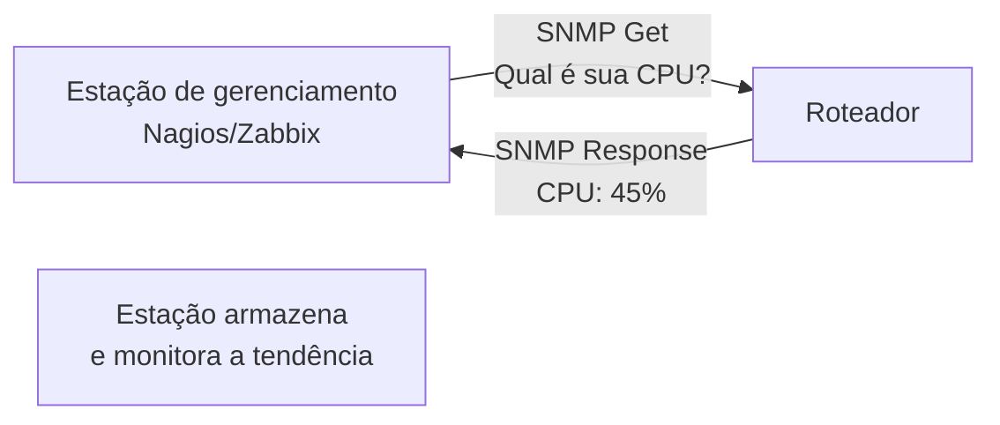
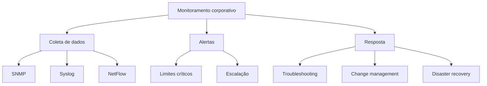

# Monitoramento avançado e resposta a incidentes

## 1. O que monitorar em uma rede

Monitoramento não é apenas "o link está online?". É uma observação contínua de:

- disponibilidade
- performance
- mudanças não autorizadas
- anomalias e padrões suspeitos
- capacidade para o futuro

Sem monitoramento, você descobre problemas quando usuários reclamam.

---

## 2. SNMP — Simple Network Management Protocol

### O que é SNMP?

SNMP é o padrão para coletar informações de dispositivos de rede (roteadores, switches, impressoras, etc).

**Função**: permitir que um gerenciador central consulte e configure dispositivos.

---

### Como funciona?



---

### Versões

| Versão | Segurança | Uso |
|---|---|---|
| SNMPv1 | nenhuma (texto simples) | legado, evite |
| SNMPv2c | comunidade (texto simples) | comum, risco |
| SNMPv3 | autenticação + criptografia | **recomendado** |

---

### Objetos SNMP (OID)

SNMP usa Object IDs (OIDs) para referir métricas.

Exemplo:
- `1.3.6.1.2.1.1.3.0` = uptime
- `1.3.6.1.4.1.9.2.1.58.0` = CPU (Cisco)
- `1.3.6.1.2.1.25.3.2.1.5` = disco (genérico)

**Regra prática**: use templates de OIDs conhecidos, não memorize números.

---

### Comando básico

```bash
# Query SNMP v2c
snmpget -v 2c -c public 192.168.1.1 1.3.6.1.2.1.1.3.0

# Walk (pega múltiplos valores)
snmpwalk -v 2c -c public 192.168.1.1 1.3.6.1.2.1.1

# SNMPv3 com autenticação
snmpget -v 3 -u username -a SHA -A authpass -x AES -X privpass 192.168.1.1 1.3.6.1.2.1.1.3.0
```

---

## 3. Syslog — Logs centralizados

### Por que logs centralizados?

Se você tem 50 roteadores, você não vai olhar logs em cada um. Precisa de um local central.

---

### Como funciona

```
[Roteador 1] \
[Roteador 2]  --> [Servidor Syslog Central] --> [Arquivo/banco de dados]
[Roteador 3] /
```

Cada dispositivo envia logs para um servidor central via UDP porta 514 (ou TCP).

---

### Níveis de severidade

| Nível | Significado | Ação |
|---|---|---|
| 0 | Emergency | ação imediata |
| 1 | Alert | ação rápida |
| 2 | Critical | requer resposta |
| 3 | Error | erro significativo |
| 4 | Warning | aviso, pode se tornar erro |
| 5 | Notice | informação importante |
| 6 | Informational | informação |
| 7 | Debug | debug apenas |

---

### Exemplo de configuração

```
Router(config)# logging 192.168.1.50
Router(config)# logging trap warnings
Router(config)# end

# Todos os logs warning e acima vão para 192.168.1.50
```

---

## 4. NetFlow e análise de tráfego

### O que é NetFlow?

NetFlow coleta estatísticas de tráfego:
- IP origem e destino
- porta origem e destino
- protocolo
- bytes transferidos
- timestamps

**Diferença do Syslog**: Syslog é eventos, NetFlow é fluxo de tráfego.

---

### Visualização

```
Origem: 10.0.0.50
Destino: 8.8.8.8
Protocolo: UDP
Porta: 53 (DNS)
Bytes: 1.234
Fluxos: 45

Origem: 192.168.1.100
Destino: 10.0.0.1
Protocolo: TCP
Porta: 3389 (RDP)
Bytes: 5.678.900
Fluxos: 1.234
```

---

### Ferramentas

- Cisco NetFlow
- sFlow (compatível com mais vendors)
- IPFIX (padrão aberto)

---

## 5. Alertas e notificações

### O que alertar?

```
CRÍTICO:
- roteador ou switch caiu
- link principal perdido
- CPU > 90%
- memória > 85%
- tráfego anômalo detectado

AVISO:
- link backup está ativo
- CPU > 70%
- perda de pacote > 5%
- latência > 100ms

INFORMAÇÃO:
- interface reset
- mudança de VLAN
- certificado vai vencer
```

---

### Canais de notificação

```
Alerta crítico:
├── E-mail + SMS + PagerDuty
├── Escalação automática (se não responder em 15 min)
└── Telefonema automático

Alerta aviso:
├── E-mail
├── Slack/Teams
└── Dashboard

Alerta informação:
└── Dashboard + log
```

---

## 6. Troubleshooting estruturado

### Metodologia OSI

Quando algo quebra, use a metodologia OSI para diagnosticar:

```
Camada 1 — Física (cabos, conectores, luz do LED)
Camada 2 — Enlace (MAC, VLAN, STP)
Camada 3 — Rede (IP, roteamento, ping)
Camada 4 — Transporte (TCP, UDP, portas)
Camada 5+ — Aplicação (banco de dados, web, email)
```

**Regra prática**: sempre comece pela camada 1. Tente rebootar o equipamento.

---

### Checklist de troubleshooting

1. **O problema é reproduzível?** (não é intermitente?)
2. **Qual é o escopo?** (um usuário, um departamento, toda a rede?)
3. **Qual é a timeline?** (quando começou? o que mudou?)
4. **Qual é o padrão?** (afeta DNS, HTTP, tudo?)

Se conseguir responder isso, você já cortou 80% das possibilidades.

---

## 7. Mudanças e janelas de manutenção

### Por que controlar mudanças?

Porque a maioria dos problemas de rede é causada por mudanças mal feitas.

---

### Processo de mudança (Change Management)

```
1. Planejamento
   - o que vai mudar?
   - qual é o risco?
   - qual é o rollback?

2. Notificação
   - avisar stakeholders
   - agendar janela de manutenção
   - ter backup de config

3. Execução
   - fazer mudança
   - testar
   - documentar

4. Validação
   - a mudança funcionou?
   - há efeitos colaterais?

5. Documentação
   - atualizar wiki/procedimentos
   - guardar config anterior
```

---

## 8. Backup e disaster recovery

### Backup de configuração

```bash
# Roteador Cisco
Router# copy running-config tftp://192.168.1.50/router-backup.cfg

# Restaurar
Router# copy tftp://192.168.1.50/router-backup.cfg running-config
```

**Regra**: backup de todas as configurações, toda semana (ou via version control).

---

### Disaster recovery plan

Ter um plano para quando tudo quebra:

- [ ] quais são os serviços críticos?
- [ ] quanto tempo de downtime é aceitável?
- [ ] como restaurar rapidamente?
- [ ] quem faz o quê?
- [ ] como testar o plano?

**RTO (Recovery Time Objective)**: máximo tempo sem serviço
**RPO (Recovery Point Objective)**: máxima perda de dados aceitável

---

## 9. Troubleshooting no Wireshark

### Captura de tráfego para análise

```bash
# Linux/Mac
tcpdump -i eth0 -w capture.pcap -c 10000

# Depois abrir no Wireshark
```

---

### O que procurar em capturas

```
Retransmissões:
tcp.analysis.retransmission

Timeouts:
tcp.time_delta > 1

DNS lento:
dns.time > 1

Pacotes fora de ordem:
tcp.analysis.out_of_order

Conexão resetada:
tcp.flags.reset
```

---

## 10. Checklist de monitoramento corporativo

- [ ] SNMP v3 configurado em todos os dispositivos?
- [ ] Syslog centralizado recebendo logs?
- [ ] NetFlow/sFlow ativo?
- [ ] Alertas críticos testados?
- [ ] Escalação de alertas configurada?
- [ ] Change management process documentado?
- [ ] Backups de config automatizados?
- [ ] Disaster recovery plan criado?
- [ ] Documentação de rede atualizada?
- [ ] Treinamento da equipe realizado?

---

## 11. Mapa mental de monitoramento



---

## 12. Exercícios de reflexão

1. Qual é a diferença entre SNMP e Syslog?
2. Como você alertaria sobre CPU alta?
3. Qual é o workflow de change management?
4. Como você faria backup de um roteador?
5. Se um serviço crítico cair, qual é seu plano?

Se você conseguir monitorar uma rede, você é um engenheiro profissional.
