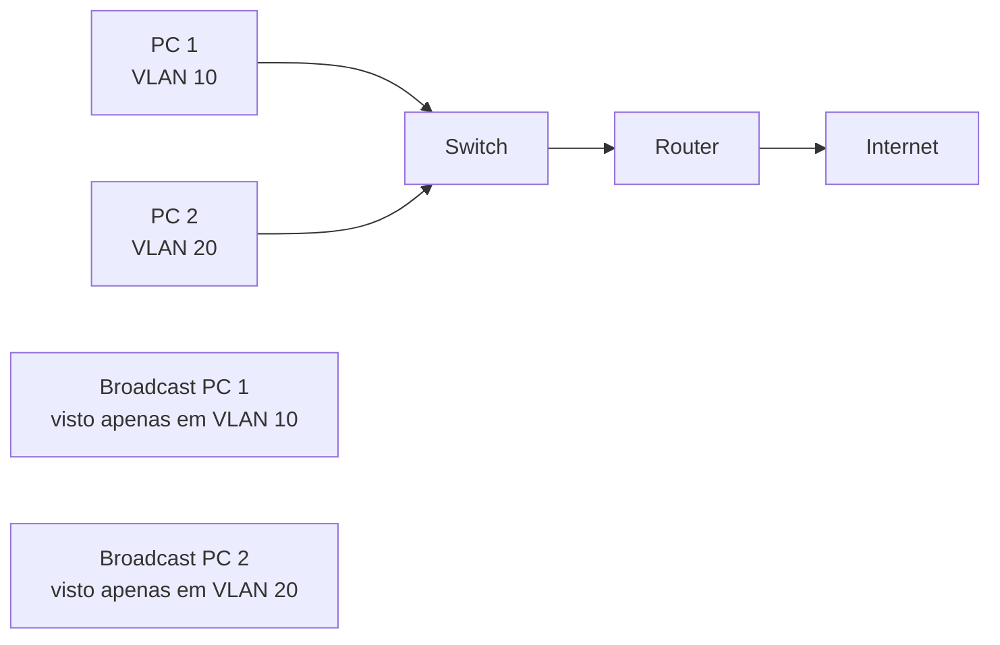
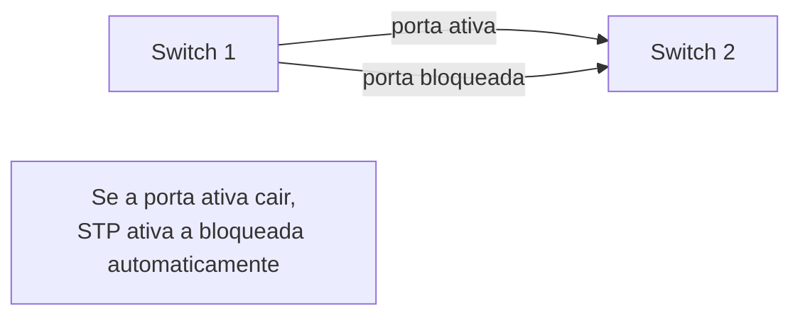
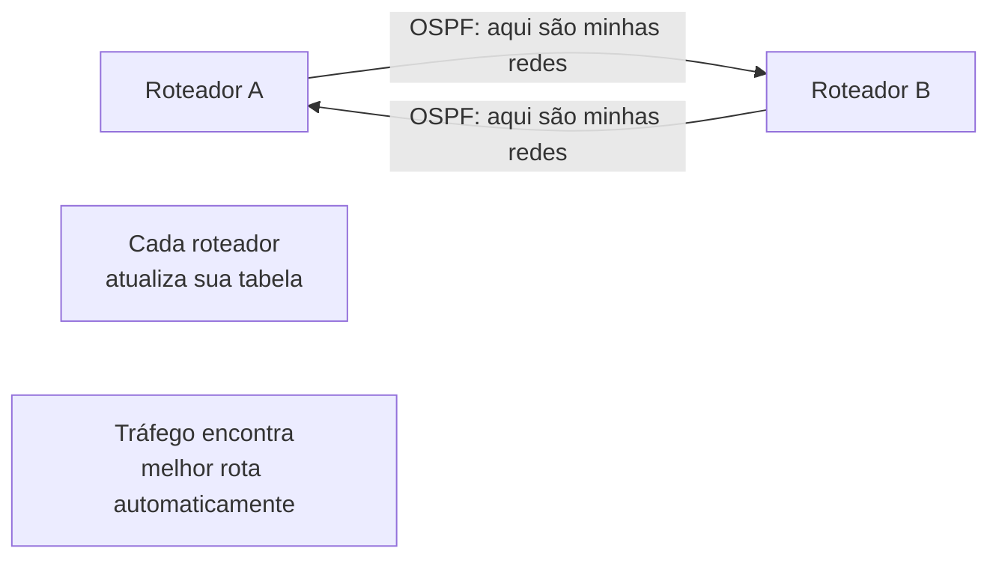
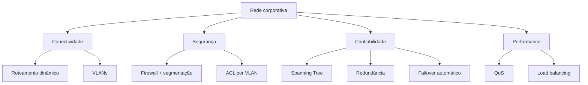

# Redes corporativas — da infraestrutura local à redundância

## 1. O desafio da escala corporativa

Uma rede corporativa não é apenas uma rede doméstica maior. É um sistema complexo que precisa:

- conectar múltiplas filiais geograficamente dispersas
- isolar tráfego de diferentes departamentos
- garantir redundância e alta disponibilidade
- escalar sem comprometer segurança ou performance
- gerenciar centenas ou milhares de dispositivos

A rede corporativa é engenharia. Não é apenas tecnologia.

---

## 2. VLAN — Virtual Local Area Network

### O que é VLAN?

VLAN cria múltiplas redes lógicas em um único switch físico.

**Sem VLAN:**
```
[Switch] --todos no mesmo domínio de broadcast
├── Gerência
├── TI
├── Vendas
├── RH
└── Operações
```

Todos recebem todo tráfego broadcast. Segurança fraca, broadcast storm possível.

---

**Com VLAN:**
```
[Switch]
├── VLAN 10 (Gerência)
├── VLAN 20 (TI)
├── VLAN 30 (Vendas)
├── VLAN 40 (RH)
└── VLAN 50 (Operações)
```

Cada VLAN é uma rede separada. O tráfego é isolado.

---

### Como funciona?



O switch taggeia os pacotes com um ID de VLAN (802.1Q). O roteador lê essa tag e roteia para a VLAN correta.

---

### Vantagens

| Vantagem | Benefício |
|---|---|
| Isolamento de tráfego | segurança, menos broadcast storm |
| Melhor performance | sem broadcast desnecessário |
| Escalabilidade | múltiplas redes no mesmo equipamento |
| Segurança | departamentos isolados |
| Flexibilidade | pode mudar VLAN sem mexer em cabos |

---

### Exemplo prático

```
Switch porta 1-8: VLAN 10 (Vendas)
Switch porta 9-16: VLAN 20 (TI)
Switch porta 17-24: VLAN 30 (RH)

Trunk port (conecta ao roteador): carrega todas as VLANs
```

O roteador recebe tráfego de todas as VLANs no trunk e roteia entre elas.

---

## 3. Spanning Tree Protocol (STP)

### O problema: loops

Se conectar dois switches com múltiplos cabos para redundância, o tráfego pode fazer loop infinito.

```
[Switch 1] ===== [Switch 2]
   |              |
   +------+-------+
```

Broadcast vai e volta, duplicando indefinidamente (broadcast storm).

---

### A solução: STP

STP detecta loops e bloqueia portas redundantes automaticamente.



**Como funciona:**
1. elege uma "raiz" (root bridge)
2. constrói uma árvore sem loops
3. bloqueia links redundantes
4. se um link cair, reativa automaticamente

---

### Tempo de convergência

- STP tradicional: ~50 segundos para mudar estado de porta
- RSTP (Rapid STP): ~1 segundo
- MSTP (Multiple STP): vários STP em paralelo

**Implicação**: em rede corporativa crítica, use RSTP. 50 segundos de downtime é inaceitável.

---

## 4. Roteamento dinâmico

### Problema: roteamento estático não escala

Com roteamento estático, você precisa adicionar rotas manualmente para cada nova rede. Não funciona em rede com centenas de rotas.

---

### Solução: protocolos de roteamento dinâmico

Os roteadores falam entre si e descobrem rotas automaticamente.



---

### Protocolos comuns

| Protocolo | Tipo | Uso | Vantagem |
|---|---|---|---|
| OSPF | Link-state | empresas | escalável, rápido |
| BGP | Path-vector | internet | controle fino, múltiplos caminhos |
| EIGRP | Distance-vector | Cisco | bom balance |
| RIP | Distance-vector | antigo | evite |

---

### OSPF em detalhes

OSPF usa o estado dos links (distância, custo) para calcular o melhor caminho.

```
Custo = 100.000.000 / bandwidth (em bps)

Link 10Mbps = 10.000
Link 100Mbps = 1.000
Link 1Gbps = 100
```

**Regra prática**: OSPF escolhe o caminho com menor custo total, que geralmente é o mais rápido.

---

## 5. Redundância e Alta Disponibilidade

### Conceitos

**Redundância**: ter caminhos/serviços alternativos
**Failover**: mudar automaticamente para o alternativo
**Disponibilidade**: % de tempo que o serviço está funcionando

---

### Arquitetura redundante

```
[Servidor Principal]
       |
[Roteador Principal] -- [Roteador Backup]
       |                       |
  [Internet]             [Internet Backup]
```

Se o roteador principal cair, o backup assume automaticamente.

---

### HSRP/VRRP/GLBP

Esses protocolos fazem failover automático de roteadores.

**Como funciona:**
1. múltiplos roteadores compartilham o mesmo IP virtual
2. um é o ativo, outros são standby
3. se o ativo cair, o standby assume em segundos

---

## 6. Segmentação de rede

### Zonas de segurança

Dividir a rede em zonas com permissões diferentes.

```
[Internet]
    |
[Firewall]
    |
    +---> [DMZ] --- [Servidores web públicos]
    |
    +---> [Zona interna] --- [Servidores corporativos]
    |
    +---> [Zona restrita] --- [Dados sensíveis]
```

Cada zona tem regras de firewall diferentes.

---

### Princípio do menor privilégio

Só permitir o tráfego necessário. Bloquear tudo mais.

```
DMZ pode acessar: internet (entrada), BD interno (saída)
DMZ NÃO pode acessar: zona restrita, dados sensíveis

Zona interna pode acessar: BD, internet
Zona interna NÃO pode acessar: zona restrita (sem motivo)
```

---

## 7. QoS — Quality of Service

### O problema: todos competem por largura de banda

Se todo tráfego tem a mesma prioridade, um download grande pode derrubar uma chamada VoIP.

---

### A solução: priorizar tráfego

```
Voip: prioridade alta
Video conferência: prioridade alta
E-mail: prioridade média
Backup: prioridade baixa
Downloads pessoais: prioridade muito baixa
```

O roteador enfileira pacotes e processa os de alta prioridade primeiro.

---

### Implementação

```
Interface Ethernet1/0 100Mbps

Política QoS:
- VoIP (porta 5060): 5Mbps garantido + burst
- Video (porta 3306): 20Mbps
- Dados (tudo mais): 75Mbps
- Best effort (sobra): compartilhado
```

---

## 8. Monitoramento de rede corporativa

### Que monitorar?

- disponibilidade de links
- uso de largura de banda
- latência e jitter
- erros e pacotes perdidos
- saúde de roteadores e switches
- mudanças de configuração

---

### Ferramentas

| Ferramenta | Função | Protocolo |
|---|---|---|
| Nagios | monitoramento de disponibilidade | ICMP, SNMP |
| Zabbix | monitoramento completo | SNMP, Syslog |
| Grafana | visualização de métricas | Prometheus, InfluxDB |
| LibreNMS | network monitoring | SNMP |
| ntopng | análise de tráfego | NetFlow |

---

## 9. Checklist de rede corporativa

Antes de considerar sua rede corporativa "pronta":

- [ ] VLANs separadas por departamento/função?
- [ ] Spanning Tree ativado (RSTP preferencialmente)?
- [ ] Roteamento dinâmico configurado?
- [ ] Redundância em links críticos?
- [ ] Failover automático testado?
- [ ] Firewall com segmentação de zonas?
- [ ] QoS configurado para VoIP/vídeo?
- [ ] Monitoramento 24/7 ativo?
- [ ] Backup de configurações e dados?
- [ ] Documentação da rede?

---

## 10. Mapa mental da infraestrutura corporativa



---

## 11. Exercícios de reflexão

1. Qual é a diferença entre VLAN e roteador?
2. Por que STP é necessário?
3. Como você testaria failover de um roteador redundante?
4. Qual é a ordem de prioridade de tráfego que você configuraria?
5. Se 30% dos links caem, como a rede deveria se comportar?

Se você conseguir desenhar uma rede corporativa com redundância, você já é um arquiteto de redes.
