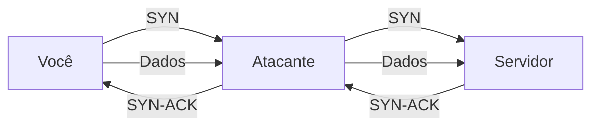
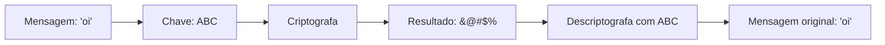
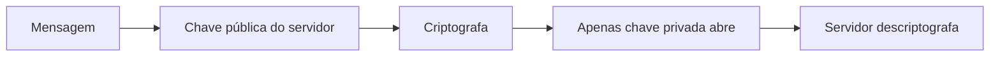
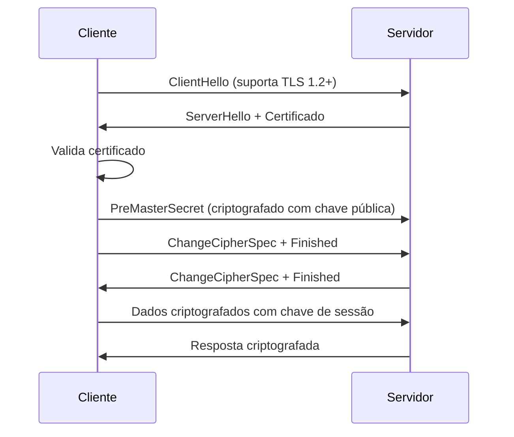
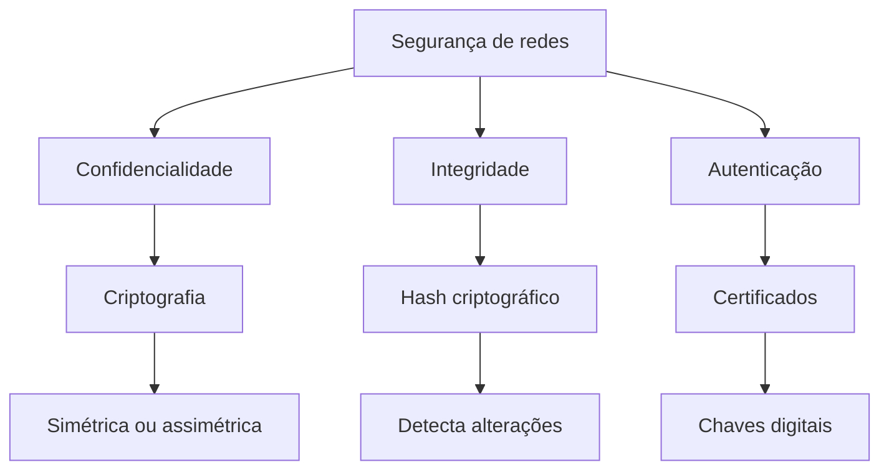

# Segurança de redes — O cadeado digital

## 1. Por que segurança de redes importa

A segurança de redes não é um módulo separado. É o coração da comunicação digital moderna.

Sem segurança:

- sua senha viaja pelo ar em texto simples
- alguém pode se passar por um servidor confiável
- dados confidenciais são expostos
- serviços podem ser derrubados por ataques

Com segurança:

- você controla quem acessa o quê
- dados sensíveis são protegidos
- a comunicação é verificável
- o tráfego é inspecionado e monitorado

A melhor forma de entender segurança é simples: imagine que toda comunicação precisa de três coisas:

1. confidencialidade (ninguém lê)
2. integridade (ninguém modifica)
3. autenticação (você sabe com quem está falando)

---

## 2. Analogia: a segurança como um sistema de correio

Imagine um sistema de correio:

- cada carta é lacrada em um envelope (confidencialidade)
- o envelope tem um selo que prova que veio de você (autenticação)
- se alguém abrir a carta e tentar fechá-la de novo, o selo quebra (integridade)
- o roteador de cartas verifica cada uma antes de entregar (firewall)
- algumas cartas são bloqueadas automaticamente (ACL)

Essa é exatamente a lógica da segurança de redes.

---

## 3. Os três pilares da segurança

### 3.1 Confidencialidade

Significa que apenas o remetente e o destinatário conseguem ler a mensagem.

**Mecanismo**: criptografia
- a mensagem é transformada em um código incompreensível
- apenas quem tem a chave consegue decodificar

**Exemplo**: HTTPS usa TLS para criptografar dados

---

### 3.2 Integridade

Significa que a mensagem não foi alterada durante o caminho.

**Mecanismo**: hash criptográfico
- um resumo único é criado a partir da mensagem
- qualquer mudança muda o hash
- o receptor verifica se o hash bate

**Exemplo**: SSH verifica a integridade de cada pacote

---

### 3.3 Autenticação

Significa que você sabe com quem está falando.

**Mecanismo**: certificados e chaves digitais
- cada servidor prova quem é
- cada cliente prova suas credenciais
- ambos verificam a identidade um do outro

**Exemplo**: HTTPS valida o certificado do servidor

---

## 4. Ataques comuns e como prevenção funciona

### 4.1 Ataque man-in-the-middle (MITM)

Alguém se coloca entre você e o servidor.

**Como TLS previne**: 
- você verifica o certificado do servidor
- você criptografa os dados
- o atacante não consegue decodificar

---

### 4.2 Ataque de força bruta

Alguém tenta todas as combinações de senha.

**Como prevenção funciona**:
- limite de tentativas
- delay após falhas
- senhas fortes e hash criptográfico
- MFA (multi-factor authentication)

---

### 4.3 Ataque de negação de serviço (DDoS)

Alguém envia tantos pacotes que o servidor não consegue responder.

**Como prevenção funciona**:
- firewall filtra tráfego anômalo
- rate limiting controla quantos pacotes por segundo
- loadbalancer distribui tráfego
- ISP bloqueia ataques em larga escala

---

### 4.4 Injeção de SQL ou XSS

Alguém tenta enviar comandos maliciosos na requisição.

**Como prevenção funciona**:
- validação de entrada
- sanitização de dados
- prepared statements em banco de dados
- Content Security Policy (CSP)

---

## 5. Criptografia — o escudo digital

### Como funciona a criptografia simétrica

**Característica**: mesma chave para criptografar e descriptografar

**Exemplo**: AES, DES, ChaCha20

---

### Como funciona a criptografia assimétrica

**Característica**: duas chaves diferentes (pública e privada)

**Exemplo**: RSA, ECDSA

**Uso**: TLS/SSL, assinatura digital

---

## 6. Certificados digitais — a identidade da rede

Um certificado digital é como um documento de identidade, mas para servidores.

### O que contém?

- nome do servidor (subject)
- chave pública do servidor
- autoridade que assinou (issuer)
- data de expiração
- assinatura digital

### Como funciona?

1. você acessa um site
2. o servidor envia seu certificado
3. você valida a assinatura com uma CA (Certificate Authority) confiável
4. você verifica se o nome bate
5. você verifica se não expirou
6. você confia no servidor

### Entidades envolvidas

| Entidade | Função |
|---|---|
| Certificate Authority (CA) | assina certificados, é a raiz de confiança |
| servidor | pede um certificado à CA |
| cliente | valida o certificado assinado |

---

## 7. O fluxo completo de uma conexão segura (HTTPS)

**O que isso significa?**

1. cliente e servidor negociam versão de TLS
2. servidor prova sua identidade com certificado
3. ambos concordam em uma chave de sessão
4. a partir daí, tudo é criptografado

---

## 8. Comparação: HTTP vs HTTPS

| Aspecto | HTTP | HTTPS |
|---|---|---|
| Criptografia | não | sim, com TLS |
| Autenticação | não | sim, certificado |
| Integridade | não | sim, HMAC |
| Porta | 80 | 443 |
| Segurança | baixa | alta |
| Performance | mais rápido | um pouco mais lento |

**Regra prática**: sempre use HTTPS para dados sensíveis

---

## 9. Outros protocolos seguros

### SSH (Secure Shell)

- acesso remoto seguro a servidores
- usa criptografia de ponta a ponta
- autenticação por chave ou senha
- muito usado em administração de sistemas

### VPN (Virtual Private Network)

- cria um túnel criptografado
- faz parecer que você está em outra rede
- protege tráfego de Wi-Fi público
- exemplos: OpenVPN, WireGuard, IPSec

### DNS over HTTPS (DoH) e DNS over TLS (DoT)

- protege consultas de DNS
- evita que ISP veja quais sites você acessa
- criptografa comunicação com servidor DNS

---

## 10. Checklist de segurança prática

Quando você está configurando uma rede ou um serviço, pergunte-se:

- [ ] os dados sensíveis estão criptografados?
- [ ] o certificado é válido e confiável?
- [ ] há autenticação forte (senhas, chaves, MFA)?
- [ ] há validação de entrada em aplicações?
- [ ] há logs de quem acessa o quê?
- [ ] há limite de taxa (rate limiting)?
- [ ] há firewall e ACL em lugar?
- [ ] há monitoramento de ameaças?
- [ ] há plano de resposta a incidentes?

---

## 11. Mapa mental da segurança

---

## 12. Exercícios de reflexão

1. Por que HTTPS é mais seguro que HTTP?
2. Qual é a diferença entre criptografia simétrica e assimétrica?
3. O que um certificado digital prova?
4. Como um atacante poderia interceptar sua comunicação sem TLS?
5. Por que é importante validar certificados?

Se você conseguir responder essas questões sem pesquisar, já entende segurança de redes em profundidade.
