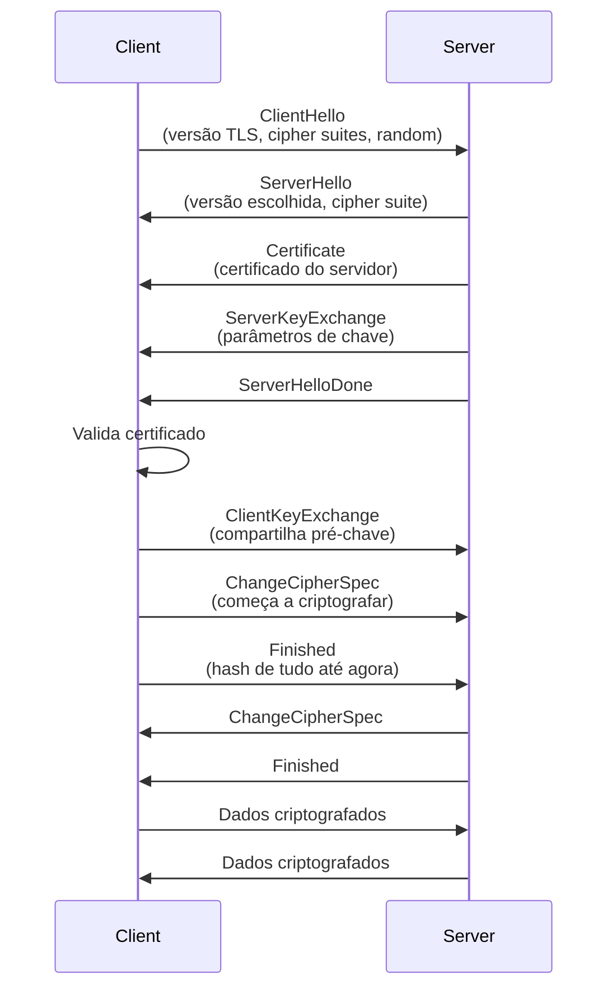
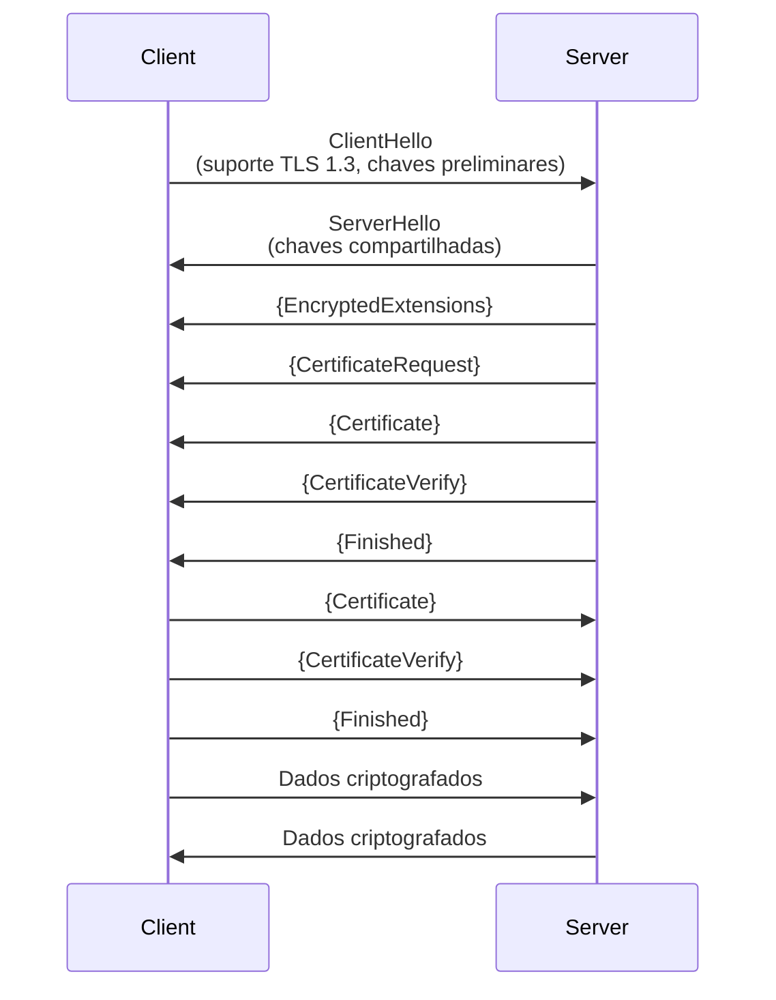

# TLS/SSL e HTTPS em profundidade

## 1. A evolução de SSL para TLS

### SSL (Secure Sockets Layer)

- versão original de 1994
- versões: SSL 2.0, SSL 3.0
- **obsoleto e inseguro** — não use mais

---

### TLS (Transport Layer Security)

- sucessor de SSL desde 1999
- versões atuais: **TLS 1.2 (2008) e TLS 1.3 (2018)**
- versões antigas (TLS 1.0, TLS 1.1) estão **sendo descontinuadas**

**Importante**: quando você vê "SSL" na web, geralmente é na verdade TLS. O termo "SSL" é antigo.

---

## 2. O que TLS faz

TLS é um protocolo que fornece:

| Objetivo | Mecanismo |
|---|---|
| Confidencialidade | criptografia dos dados |
| Integridade | hash criptográfico de cada mensagem |
| Autenticação | certificado digital do servidor |
| Forward Secrecy | chaves descartadas após uso |

---

## 3. O handshake TLS completo

### TLS 1.2 (tradicional)



**Tempo típico**: 2-3 round trips (latência percebida)

---

### TLS 1.3 (moderno)



**Tempo típico**: 1 round trip (mais rápido!)

**Vantagem**: menos latência, handshake simultâneo

---

## 4. Certificados digitais em detalhe

### O que um certificado contém?

```
Certificate:
    Version: 3
    Serial Number: 0x1a2b3c4d
    Signature Algorithm: sha256WithRSAEncryption
    Issuer: CN=Let's Encrypt Authority X3
    
    Validity:
        Not Before: Jan  1 00:00:00 2024 GMT
        Not After: Apr  1 00:00:00 2024 GMT
    
    Subject: CN=example.com
    
    Public Key:
        Modulus: (2048 bits)
        Exponent: 65537
    
    X509v3 Extensions:
        Subject Alternative Name: DNS:www.example.com
        Key Usage: Digital Signature, Key Encipherment
        Extended Key Usage: TLS Web Server Authentication
    
    Signature:
        (assinatura da CA)
```

### Cadeia de certificados

```
Seu navegador
    ↓ confia em (CA raiz)
CA Raiz (DigiCert, Let's Encrypt, etc)
    ↓ assina
CA Intermediária
    ↓ assina
Certificado do Servidor (example.com)
```

**Por que há intermediários?**
- CAs raiz mantêm suas chaves offline
- CAs intermediárias fazem o trabalho do dia a dia
- se uma intermediária for comprometida, a raiz pode revogar

---

## 5. Validação de certificado

Quando você acessa https://example.com, o navegador:

1. **Recebe o certificado do servidor**
2. **Valida a assinatura**: usa a chave pública da CA para verificar que a CA realmente assinou
3. **Verifica a cadeia**: segue até uma CA raiz confiável
4. **Valida o nome (CN/SAN)**: verifica se example.com está no certificado
5. **Valida a data**: verifica se não está expirado
6. **Valida o uso**: verifica se é para TLS web
7. **Verifica revogação**: (às vezes) verifica se foi revogado

Se qualquer passo falhar, o navegador mostra um aviso.

---

## 6. Tipos de certificado

### Certificado DV (Domain Validation)

- valida que você controla o domínio
- mais rápido e barato
- menos confiável

**Exemplo**: Let's Encrypt

---

### Certificado OV (Organization Validation)

- valida que você controla o domínio
- valida que a organização existe
- mais caro e mais lento

**Exemplo**: Comodo, GlobalSign

---

### Certificado EV (Extended Validation)

- valida tudo
- barra verde no navegador
- mais caro
- menos usado modernamente

---

### Certificado Wildcard

```
*.example.com
```

Cobre todos os subdomínios:
- www.example.com ✅
- api.example.com ✅
- mail.example.com ✅
- exemplo.com ❌ (não cobre o domínio raiz)

---

### Certificado Multi-SAN

```
example.com
www.example.com
api.example.com
example.net
www.example.net
```

Cobre múltiplos domínios

---

## 7. Algoritmos de criptografia em TLS

### Key Exchange (como gerar a chave de sessão)

| Algoritmo | Caractere | Nota |
|---|---|---|
| RSA | lento, sem PFS | **evite** |
| DHE (Diffie-Hellman Ephemeral) | bom, PFS | aceitável |
| ECDHE (Elliptic Curve Diffie-Hellman Ephemeral) | rápido, PFS | **recomendado** |

**PFS (Perfect Forward Secrecy)**: chaves de sessão antiga não são comprometidas se chave privada for

---

### Encryption (criptografia de dados)

| Algoritmo | Bits | Status |
|---|---|---|
| AES-GCM | 128 ou 256 | recomendado |
| ChaCha20-Poly1305 | 256 | recomendado |
| AES-CBC | 128 ou 256 | aceitável, não ideal |
| DES | 56 | **obsoleto** |

---

### Hash (integridade)

| Algoritmo | Tamanho | Status |
|---|---|---|
| SHA-256 | 256 bits | recomendado |
| SHA-384 | 384 bits | recomendado |
| SHA-1 | 160 bits | **deprecado** |
| MD5 | 128 bits | **nunca use** |

---

## 8. HTTPS em ação

### Fluxo completo de uma requisição HTTPS

```mermaid
flowchart LR
    A["Navegador<br/>https://example.com"] --> B["TCP SYN"]
    B --> C["TLS Handshake"]
    C --> D["Certificado validado"]
    D --> E["Chave de sessão acordada"]
    E --> F["GET / HTTP/1.1"]
    F --> G["Criptografado"]
    G --> H["Servidor descriptografa"]
    H --> I["Servidor processa"]
    I --> J["HTTP 200 OK"]
    J --> K["Criptografado"]
    K --> L["Navegador descriptografa"]
    L --> M["Página renderizada"]
```



---

## 9. Problemas comuns com HTTPS

### 9.1 "Certificado inválido"

**Possíveis causas**:
- data/hora do sistema errada
- certificado expirado
- domínio não corresponde
- certificado auto-assinado

**Como resolver**:
- verificar data/hora
- renovar certificado
- verificar configuração do servidor
- adicionar CA customizada se necessário

---

### 9.2 "Certificado de autoridade desconhecida"

**Possíveis causas**:
- CA intermediária não está instalada
- navegador não confia na CA
- certificado auto-assinado

**Como resolver**:
- instalar certificado intermediário
- adicionar CA ao navegador (não recomendado)
- usar CA confiável

---

### 9.3 "Não consegue fazer TLS handshake"

**Possíveis causas**:
- firewall bloqueando porta 443
- servidor não suporta TLS 1.2+
- client não suporta cipher suite que servidor oferece

**Como resolver**:
- verificar firewall
- atualizar versão de TLS
- verificar cipher suites compatíveis

---

## 10. Verificando certificados com Wireshark

### Filtros úteis

- `ssl` ou `tls` — mostra pacotes TLS
- `ssl.handshake.type == 2` — mostra ServerHello
- `ssl.record.version == 0x0303` — TLS 1.2

### O que observar em Wireshark

1. Cliente envia ClientHello (TLS version, cipher suites)
2. Servidor responde com ServerHello + Certificate
3. Cliente valida certificado (você não vê isso no Wireshark)
4. Ambos concordam em chave de sessão
5. A partir daí, tudo é "Encrypted Application Data"

Se você vê "Encrypted Application Data", significa que o TLS funcionou.

---

## 11. Boas práticas de TLS

### Para desenvolvedores

- ✅ sempre use HTTPS
- ✅ use certificados válidos (Let's Encrypt é grátis)
- ✅ configure TLS 1.2 ou 1.3
- ✅ use ECDHE para key exchange
- ✅ use AES-GCM ou ChaCha20 para encryption
- ❌ não desabilite validação de certificado
- ❌ não use cipher suites fracas

### Para administradores

- ✅ renovar certificados antes de expirar
- ✅ manter TLS atualizado
- ✅ monitorar certificados com ferramentas
- ✅ usar HTTP Strict-Transport-Security (HSTS)
- ❌ não aceitar certificados auto-assinados sem motivo
- ❌ não usar certificados expirados

---

## 12. Checklist para validar HTTPS

- [ ] acessei um site com https://
- [ ] navegador mostra cadeado verde
- [ ] certificado é válido e não expirou
- [ ] domínio no certificado corresponde ao site
- [ ] TLS version é 1.2 ou 1.3
- [ ] cipher suite usa ECDHE ou similar
- [ ] encryption usa AES-GCM ou ChaCha20
- [ ] hash usa SHA-256 ou similar
- [ ] capturei o handshake no Wireshark

Se você marcar todas, você entende HTTPS profundamente.
