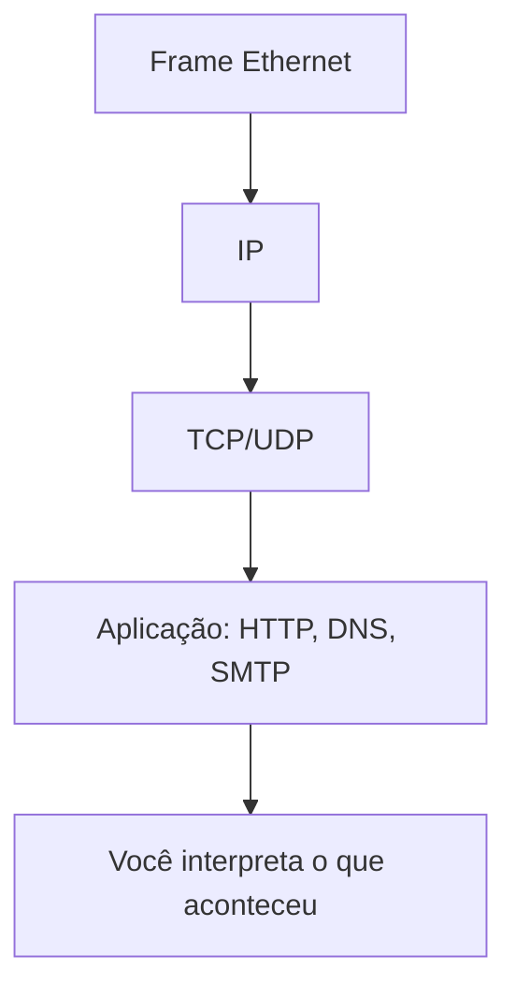
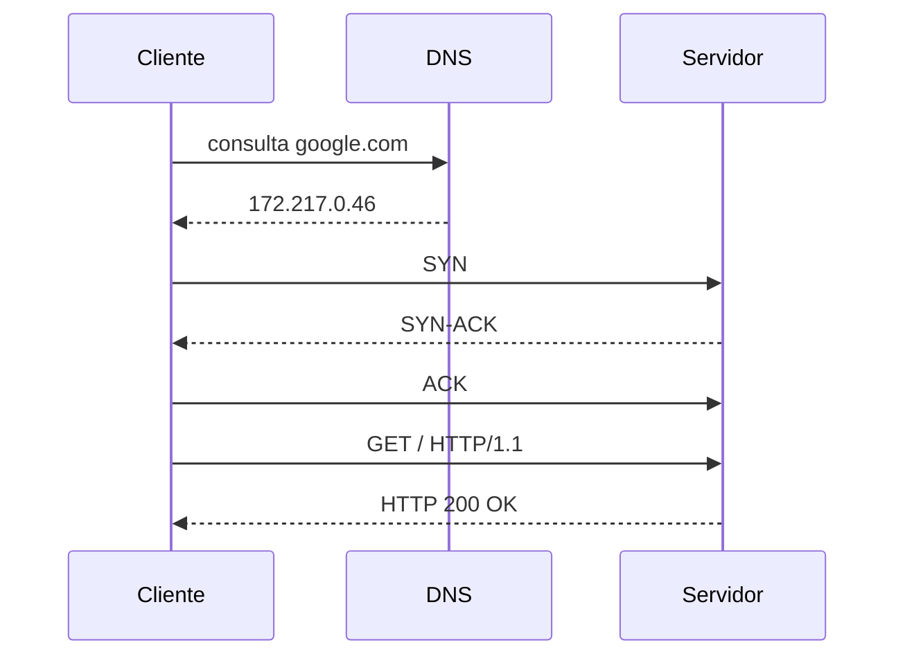
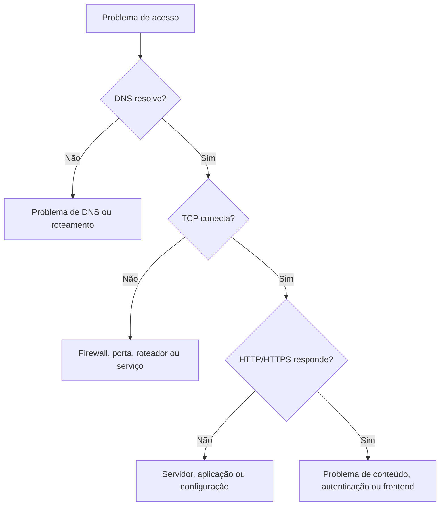

# Wireshark, troubleshooting e diagnóstico real de rede

## 1. Por que Wireshark é tão importante?

O Wireshark é a ferramenta que transforma rede de teoria em observação real. Em vez de imaginar como os pacotes circulam, você consegue ver:

- quem está falando com quem
- quais protocolos estão sendo usados
- a ordem dos pacotes
- atrasos e retransmissões
- falhas de DNS, TCP, HTTP e portas

Em outras palavras, o Wireshark é o microscópio da rede.

---

## 2. A lógica de leitura de um pacote

Quando você captura tráfego, cada pacote contém informações que representam camadas diferentes da comunicação.



### O que olhar primeiro

1. Endereço origem e destino
2. Protocolo da camada superior
3. Porta de origem e destino
4. Sequência e confirmação do TCP
5. Status da resposta
6. Conteúdo da aplicação

Sem essa visão, o pacote é apenas uma sequência de bytes sem significado.

---

## 3. Filtros essenciais no Wireshark

A prática mais útil no Wireshark é filtrar. Filtros ajudam a separar o ruído e mostrar apenas o fluxo relevante.

### Filtros por protocolo

- `dns`
- `http`
- `tcp`
- `udp`
- `arp`
- `icmp`
- `smtp`
- `ssl`

### Filtros por endereço

- `ip.addr == 8.8.8.8`
- `ip.src == 192.168.0.10`
- `ip.dst == 10.0.0.5`

### Filtros por porta

- `tcp.port == 443`
- `udp.port == 53`
- `http.request.method == "GET"`
- `http.response.code == 200`

### Filtros para análise de conexão

- `tcp.flags.syn == 1`
- `tcp.flags.syn == 1 and tcp.flags.ack == 1`
- `tcp.analysis.retransmission`
- `tcp.stream eq 0`

Esses filtros são usados para identificar handshake, retransmissão e falhas de transporte.

---

## 4. A sequência real de uma navegação



### Interpretação

- o cliente precisa resolver o nome do domínio
- o endereço IP é retornado pelo DNS
- o TCP estabelece a conexão
- a aplicação realiza a requisição
- a resposta retorna ao cliente

Esse fluxo é o coração da internet.

---

## 5. Como diagnosticar problemas de rede

A melhor forma de resolver problemas é seguir uma ordem lógica.

### Passo 1 — O problema é de conectividade?

- o host consegue fazer ping?
- há resposta ICMP?
- há perda de pacote?

### Passo 2 — O problema é de resolução de nome?

- o cliente consegue resolver o domínio?
- há resposta DNS?
- é um problema de servidor DNS ou de cache?

### Passo 3 — O problema é de porta ou serviço?

- a porta certa está aberta?
- o cliente está tentando a porta correta?
- o servidor está ouvindo na porta esperada?

### Passo 4 — O problema é de transporte?

- há SYN, SYN-ACK, ACK?
- há retransmissão?
- há timeout?

### Passo 5 — O problema é de aplicação?

- a página não carrega por que o servidor está lento?
- há erro 404, 500 ou 503?
- há falhas na autenticação, no TLS ou no backend?

---

## 6. Problemas comuns e como identificá-los

### 6.1 DNS não resolve

Sinais no Wireshark:

- nenhuma resposta DNS
- timeout de consulta
- servidor DNS inacessível

Possíveis causas:

- falha de roteamento
- firewall bloqueia UDP/53
- servidor DNS indisponível

---

### 6.2 Conexão demora ou cai

Sinais no Wireshark:

- repetição de SYN
- ausência de SYN-ACK
- retransmissões no TCP

Possíveis causas:

- roteador com problema
- filtros de firewall
- saturação de rede
- serviço indisponível

---

### 6.3 Página não abre, mas o serviço responde

Sinais no Wireshark:

- conexão TCP aberta com sucesso
- resposta HTTP errada
- código 404, 500 ou 503

Possíveis causas:

- erro no servidor
- rota mal configurada
- aplicação com falha interna

---

### 6.4 TLS/HTTPS falhando

Sinais no Wireshark:

- handshake TLS incompleto
- certificado inválido
- conexão interrompida antes da aplicação

Possíveis causas:

- data/time do sistema errado
- certificado inválido
- proxy ou interceptação

---

## 7. Analisando um fluxo HTTP real

### Requisição

```http
GET /index.html HTTP/1.1
Host: example.com
User-Agent: Mozilla/5.0
Accept: text/html
```

### Resposta

```http
HTTP/1.1 200 OK
Content-Type: text/html
Content-Length: 1234

<html>...</html>
```

### O que isso mostra?

- o cliente solicitou o recurso
- o servidor respondeu com sucesso
- a aplicação conseguiu entregar o conteúdo

Se o código fosse 404, 500 ou 503, a análise mudaria completamente.

---

## 8. Diferença entre falha de rede e falha de aplicação

Nem todo problema “parece” de rede. Às vezes o pacote chega corretamente, mas a aplicação falha.

### Exemplo

- TCP conecta
- HTTP chega ao servidor
- o servidor responde 500

Isso não é falha de roteamento. É falha de aplicação ou serviço.

Esse é um ponto importante: é preciso distinguir:

- falha física
- falha de roteamento
- falha de DNS
- falha de transporte
- falha de serviço

---

## 9. Checklist prático para análise

Antes de dizer “a rede está ruim”, faça estas perguntas:

- o domínio resolve?
- houve handshake TCP?
- a porta correta está aberta?
- o servidor respondeu?
- houve retransmissão?
- houve resposta HTTP válida?
- o problema está no cliente, no roteador, no servidor ou no aplicativo?

Essas perguntas são mais valiosas do que decorar nomes de campos do pacote.

---

## 10. Mapa mental do diagnóstico



---

## 11. Regra prática final

A rede só parece complexa quando você tenta memorizar tudo sem ver o fluxo. Quando você entende a sequência lógica:

- nome → IP
- IP → rota
- TCP → conexão
- aplicação → serviço

o diagnóstico deixa de ser “mágica” e passa a ser técnica.

---

## 12. Exercícios de reflexão

1. Explique a diferença entre falha de DNS e falha de roteamento.
2. O que indica um SYN repetido em Wireshark?
3. Como reconhecer uma resposta HTTP 200?
4. Qual é a diferença entre uma conexão TCP que não inicia e uma que inicia mas não responde?
5. O que você faria primeiro para diagnosticar um site que não abre?

Se você conseguir responder essas questões sem olhar a teoria, você já está pensando como um analista de redes.
